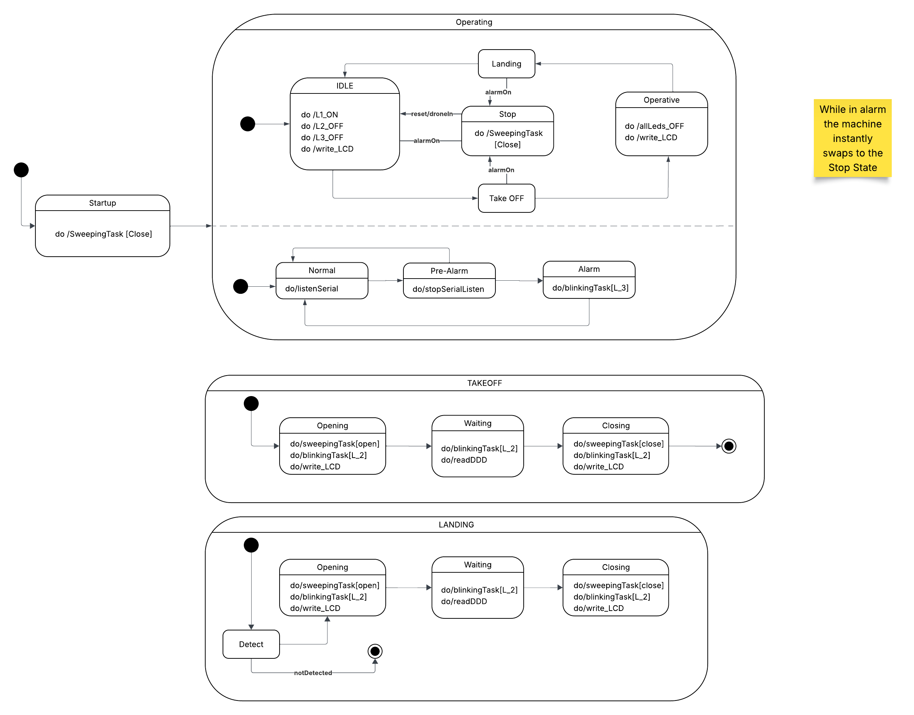
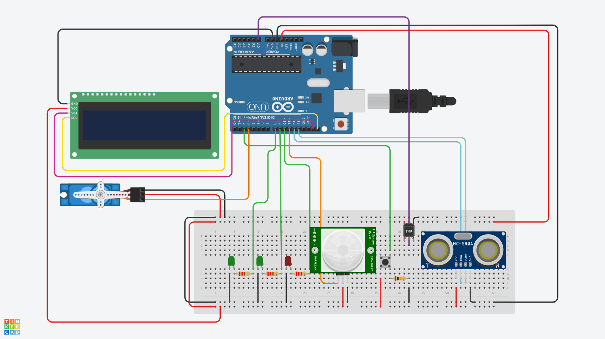

# Assignment #02 – Smart Drone Hangar
## Embedded Systems and IoT – ISI LT – a.y. 2025/2026

---

**Authors:** Gioele Foschi, Matteo Tonelli, Manuel Benagli  
**Student IDs:** 0001122551, 0001117913, 0001128371
**Date:** `15/05/2026`

---

## 1. System Overview

Brief description of the system and its purpose.

> The *Smart Drone Hangar* is an embedded system composed of two subsystems: the **Drone Hangar** (Arduino-based) and the **Drone Remote Unit** (PC-based), communicating over a serial line.

---

## 2. Parameter Choices

The following values were chosen for the configurable parameters:

| Parameter | Value | Description |
|-----------|-------|-------------|
| `D1` | 1cm | Distance threshold for drone exit detection |
| `D2` | 1cm | Distance threshold for drone landing detection |
| `T1` | 5s | Time the distance must exceed D1 to confirm exit |
| `T2` | 5s | Time the distance must stay below D2 to confirm landing |
| `T3` | 5s | Time above Temp1 before entering pre-alarm |
| `T4` | 5s | Time above Temp2 before entering full alarm |
| `Temp1` | 27 °C | Pre-alarm temperature threshold |
| `Temp2` | 30 °C | Full alarm temperature threshold |

---

## 3. Architecture
### 3.1 Finite State Machines

| State | Description | Transitions |
|-------|-------------|-------------|
| `Idle` | Drone at rest inside hangar. L1 on. | `TakeOff` cmd → `TakingOff` |
| `TakingOff` | Door open, waiting for drone to exit. L2 blinks. | dist > D1 for T1 s → `Operating` |
| `Operating` | Drone outside, door closed. | `Land` cmd + DPD detected → `Landing` |
| `Landing` | Door open, waiting for drone to land. L2 blinks. | dist < D2 for T2 s → `Idle` |
| `Stopped` | All ops suspended. | Wait for *security state* **reset** |
| `Normal` | Normal behaviour | dist < D2 for T2 s → `Idle` |
| `Warning` | High temp detected; new ops suspended. | temp < Temp1 → ``; temp ≥ Temp2 for T4 s → `Alarm` |
| `Danger` | Full alarm. L3 on. All ops suspended. | `RESET` pressed → `Normal` |

The system relies on a main handler class (`Context`) that maintains two concurrent states:
- `HangarState` (`Idle`, `Operating`, `TakeOff`, `Landing`)
- `SecurityState` (`Normal`, `Warning`, `Danger`)

#### 3.1.1 Hangar States
> Hangar states transition in a fixed cycle: `Idle` → `TakeOff` → `Operating` → `Landing` → `Idle` → ...

Upon entering a state, the state registers the tasks it needs into the scheduler.
- E.g. `IdleState` adds the temperature reading task and the `DRUReceiver`.
- The state keeps track of the tasks it registered by storing their ids in a list, so they can be identified and removed later.
- Some states (`TakeOff` and `Landing`) are divided in several smaller states to handle each section of the state.

Once the tasks are initialized, the state begins checking its transition condition. When the condition is met, the state signals the scheduler to remove its tasks and triggers a context switch.

#### 3.1.2 Security States
> Security states can transition between each other and are also able to override the current hangar state.

If the security state becomes `Danger`, it forces the hangar state — regardless of what it currently is — into a stopped state where all operations are halted.

Security states expose a special method: `canReceiveMessage`.
- This method is called every time the Arduino receives a message. It returns `true` if the current security state allows incoming messages, `false` otherwise.

---

### 3.2 Task-Based Architecture (Arduino)
The Arduino software is structured around the following concurrent tasks:

| Task | Period | Description |
|------|--------|-------------|
| `TaskDPD` | Every Scheduler Tick | Reads the PIR sensor (Drone Presence Detector) |
| `TaskDDD` | Every Scheduler Tick | Reads the sonar (Drone Distance Detector) |
| `TaskTemp` | Every Scheduler Tick | Reads the temperature sensor |
| `TaskServo` | Every Scheduler Tick | Controls the servo motor (Hangar Door) |
| `LEDBLink` | 500 ms | Makes a specific led blink |
| `TaskSerial` | 50 ms | Handles serial communication with the DRU |
| `DRUDistance` | 400 ms | Sends to the DRU the current distance from the drone |
| `ButtonTask` | Every Scheduler Tick | Checks if a button is pressed |

Some tasks are special in that they can trigger a context switch. These tasks take an additional constructor parameter:
- `ContextType`: an `enum` that indicates which state should be queried for the context switch check.

## 5. Hardware Schema

## 8. Demo Video

> See `doc/assignment-02.mp4` (not present in the remote repository to reduce repository dimensions).