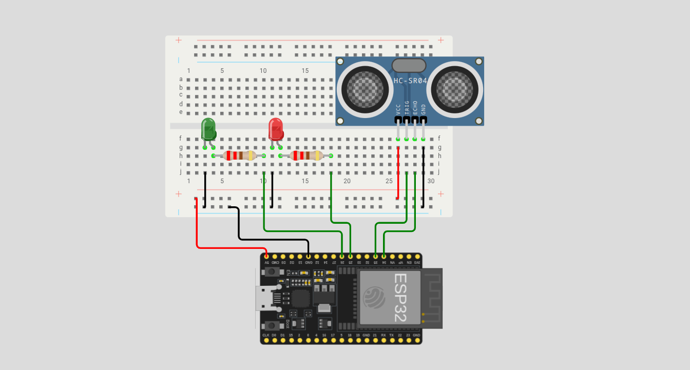
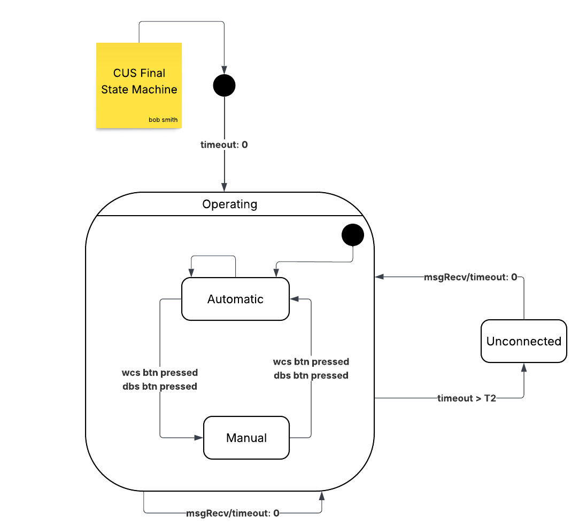
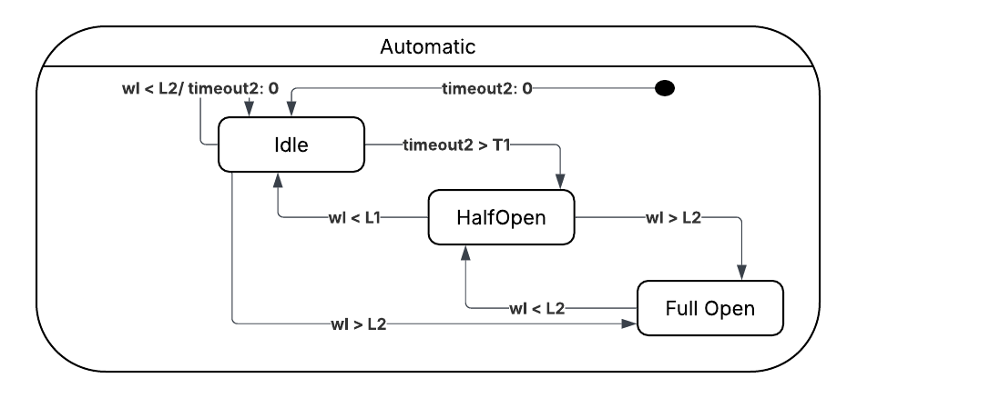
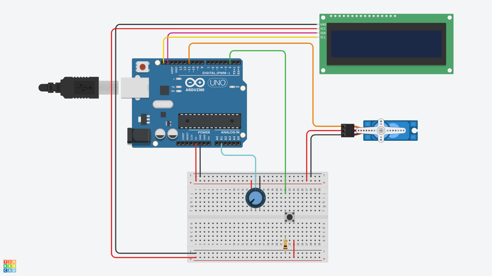
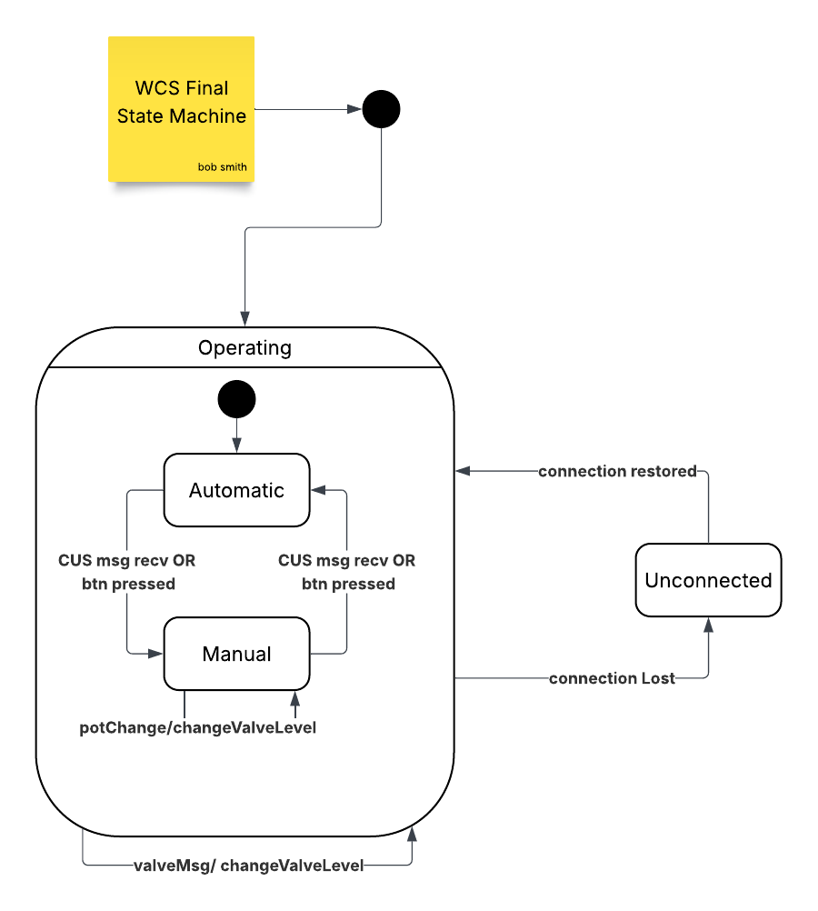
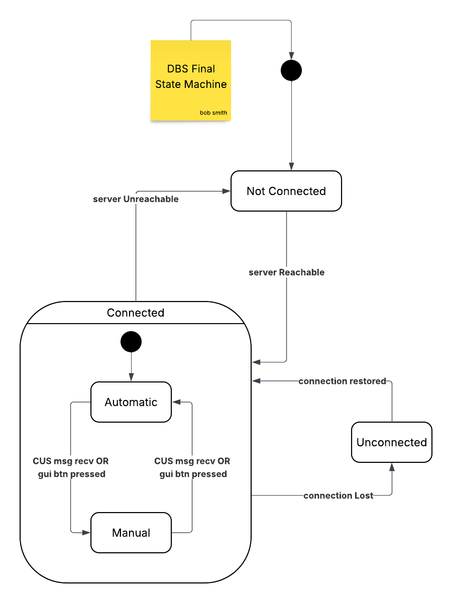

# Smart Rainwater Management System — Architecture Report

---

## System Components

### 1. Tank Monitoring Subsystem (TMS)
**Platform:** ESP microcontroller (embedded)

The TMS is responsible for reading the rainwater level in the storage tank and transmitting that data to the Control Unit. It is implemented as a single, self-contained source file.

**Communication:**
- Publishes water level readings to the Control Unit Subsystem (CUS) via **MQTT** to a remote broker.

#### Circuit

---

### 2. Control Unit Subsystem (CUS)
**Platform:** PC (Java back-end, Vert.x framework)

The CUS is the central coordinator of the entire system. It is built using the **Vert.x** library and structured around four independent peer agents that communicate internally through the Vert.x **Event Bus** and share state through a **Vert.x Local Map**.

> The following is the in-depth graph of the automatic state:

**Communication:**
- Receives water level data from TMS via **MQTT**
- Sends/receives control commands to/from WCS via **serial line**
- Exposes REST API endpoints to DBS via **HTTP**

#### Shared State (Vert.x Local Map)
All four agents read from and write to three shared variables:

| Variable | Description |
|---|---|
| `waterLevel` | Latest water level reading from the ESP |
| `currentState` | Current operational state of the system |
| `lastState` |  Operational state of the system before losing connection |
| `valveLevel` | Current valve opening level (%) |

#### Agents

**MQTT Agent**
- Subscribes to MQTT topics and receives water level messages published from the TMS.
- Parses incoming data, stores the water level reading in the shared local map.
- Fires a `msgReceived` event on the Vert.x Event Bus to notify other agents.

**Timer Agent**
- Listens for `msgReceived` events from the MQTT Agent.
- Evaluates water level readings and manages watchdog timers to enforce system conditions, such as handling an unconnected state or triggering the 50% and 100% valve opening levels.
- Fires `valveChanged` and `stateChanged` events on the Event Bus, both of which are consumed by the Serial Agent.

**Serial Agent**
- Listens for:
  - Serial messages arriving from the WCS (Arduino).
  - `valveChanged` and `stateChanged` events from the Timer Agent and the HTTP Agent.
- Manages all bidirectional communication with the Arduino subsystem over the serial line.

**HTTP Agent**
- Exposes three REST API endpoints for the Dashboard:

| Method | Endpoint | Description |
|---|---|---|
| `GET` | `/updateUI` | Returns water level reading, timestamp, current state, and valve level |
| `POST` | `/interaction/valve` | Updates the valve level; fires an event consumed by the Serial Agent |
| `POST` | `/interaction/state` | Updates the system state; fires an event consumed by the Serial Agent |

---

### 3. Water Channel Subsystem (WCS)
**Platform:** Arduino (embedded)

The WCS controls the physical water channel valve connecting the storage tank to the distribution network. It also provides a local operator panel for on-site interaction.

**Communication:**
- Communicates with the CUS via **serial line** (bidirectional).
- Provides a **physical panel** (button + potentiometer) for human operators.

#### Circuit

#### Architecture: Asynchronous Finite State Machine (FSM)

The WCS is implemented as an **async FSM** driven by the **Observer Pattern** and **State Pattern**. It reacts to three event types:

| Event | Source | Description |
|---|---|---|
| Button event | Physical panel | Operator presses the local button |
| Potentiometer event | Physical panel | Operator adjusts the valve manually via potentiometer |
| Serial message event | CUS (serial line) | Command or update received from the Control Unit |

Each state encapsulates its own behavior, and transitions are triggered by the events above via registered observers.

---

### 4. Dashboard Subsystem (DBS)
**Platform:** Browser / PC (npm web application, front-end)

The DBS is a web-based interface that allows remote operators to monitor system status and issue control commands.

**Communication:**
- Communicates with the CUS via **HTTP** (polling GET requests + POST requests).

#### Features
- **Polling:** Periodically calls the CUS `GET /updateUI` endpoint to retrieve and display the latest water level, timestamp, system state, and valve level.
- **Valve control:** Sends a `POST /interaction/valve` request to update the valve opening level.
- **State control:** Sends a `POST /interaction/state` request to change the system's operational state.
